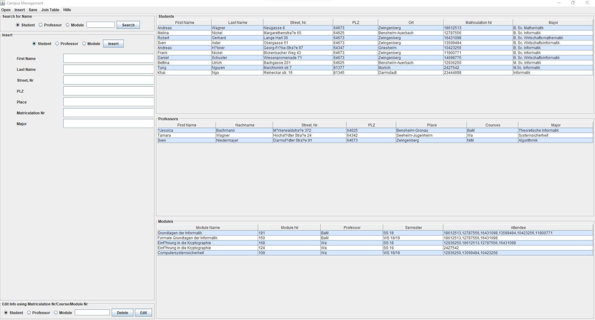
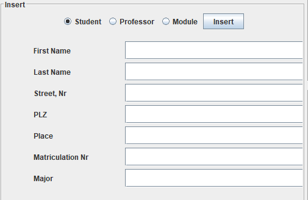
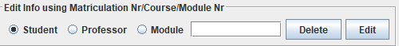
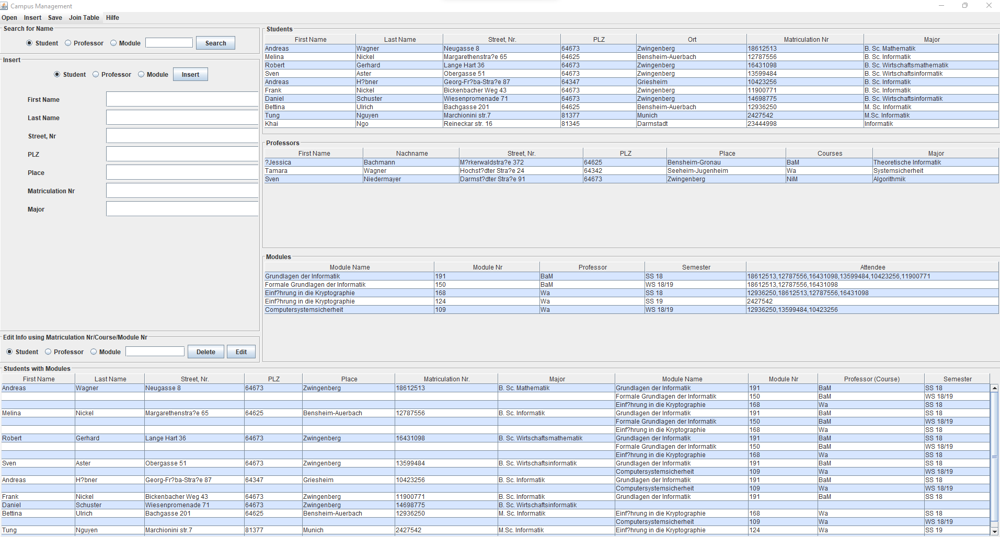

# University Campus Manager
This is a toy GUI application for managing the students/courses/professors in an university. 

# Overview

# Functionalities
- Add students/modules/professors 

- Search for students/modules/professors based on given name

- Edit/Delete the students/modules/professors

- Join the different table entities

- Further Extensions: Open & Insert students/modules/professors from files; Save the changed data in specified file

## Consistency
For simplicity, the data is saved into the .txt files in [txtdb/](./txtdb/)